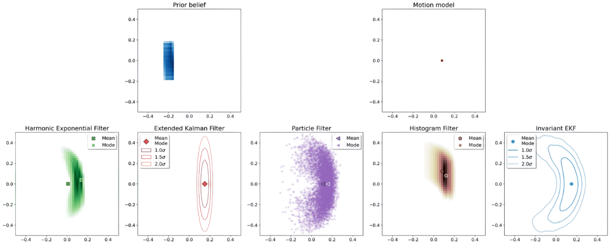

# The Harmonic Exponential Filter

Code implementation for the paper "The Harmonic Exponential Filter for Nonparametric Estimation on Motion Groups". Examples in S1 and SE(2) (doors dataset and landmark simulator) are included.

<p align="center">
  
</p>

## Installation

First clone the repository:

```bash
git clone git@github.com:montrealrobotics/harmonic-filter.git
```

Then create a virtual environment and run the following commands.

```bash
# Install Venv
pip3 install --upgrade pip
pip3 install --user virtualenv

# Create Env
cd harmonic-filter
python3 -m venv venv
# Activate env
source venv/bin/activate
```

Continue installing the project dependencies.

```bash
pip3 install -r requirements.txt
pip3 install -e .
export PYTHONPATH=~/<PATH>/harmonic-filter:$PYTHONPATH
```

If [conda](https://conda.io/projects/conda/en/latest/index.html) is preferred, we provide a `yml` file with the required dependencies.

```bash
conda env create --file=build/environment.yml
```

### Getting started
We provive a [jupyer notebook](s1_bayes_filter.ipynb) with a Bayes filter implemented on the circle (S1). This file also includes a quick walkthrough over the product and convolution operations using the harmonic exponential distribution and harmonic analysis. To run it, simply execute the following command:

```bash
jupyter-notebook s1_bayes_filter.ipynb
```

### Running experiments in  SE(2)

The whole project relies on [hydra](https://hydra.cc/) to handle the configuration files. These files are located in the `conf` folder. For instance, the landmark-only simulation experiment ([se2_landmark_filter.py](se2_landmark_filter.py)) can be executed with the following command:

```bash
python3 se2_landmark_filter.py filter.n_samples=80 duration=100
```

Similarly, the bearing-only doors' experiment ([se2_door_filter.py](se2_door_filter.py)) can be run with the following command:

```bash
python3 se2_doors_filter.py duration=50
```

Lastly, we also provide a dummy bi-modal experiment in SE(2) ([se2_filter.py](se2_filter.py)).

```bash
python3 se2_filter.py
```

All the results of the experiment are logged in the `results` folder which is created automatically when an experiment is run. Useful information such as metrics and images are stored automatically there. Below is the expected folder structure.

```bash
├── 2024-05-03T09:58:46.508015
│   ├── figures 
│   ├── others
│   │   ├── config_tree.log
│   │   ├── results.json
│   │   ├── se2_nll.png
│   │   └── se2_traj.png
│   ├── result.mp4
│   └── temp
├── 2024-05-03T10:00:12.079879
│   ├── figures 
│   ├── others
│   │   ├── config_tree.log
│   │   ├── results.json
│   │   ├── se2_nll.png
│   │   └── se2_traj.png
│   ├── result.mp4
│   └── temp
.
.
.
```

Note that further configuration parameters are available in the configuration file of each experiment located in the `conf` directory. Parameters of interest that can be configured are the motion noise, measurement noise, prior noise, among others. For further detail, please check the `conf` folder.

Another important remark is that the project can be easily configured to log information into [comet-ml](https://www.comet.com/site/). If you want to use this feature, please configure [comet.yaml](conf/logger/comet.yaml) with your credentials. To log the results of your experiment, add the following flags.

```bash
python3 se2_doors_filter.py duration=50 logger=comet logger.tag=my-awesome-tag
```

## Tests

We provide various tests used to validate whether the code was running as expected. These `tests` are also a good playground to learn more about the code. For instance, you can run one of them as follows.

```bash
python3 tests/test_s1_moments.py
```

## Miscellaneous

In the `examples` folder we provide multiple scripts with interesting examples. One of such examples is [se2_banana_dist.py](examples/se2_banana_dist.py). To run it, execute the following command.

```bash
python3 examples/se2_banana_dist.py
```

The above command will produce this image.



## Citation

If you found this code useful, please use the following citation.

```bibtex
@article{saavedra2024hef,
	title        = {The Harmonic Exponential Filter for Nonparametric Estimation on Motion Groups},
	author       = {Saavedra-Ruiz Miguel, Parkison Steven, Arora Ria, Forbes James, and Paull Liam},
	year         = 2024,
	journal      = {Preprint}
}   
```

### Ackowldegements

This code would have not been possible without [lie-learn](https://github.com/AMLab-Amsterdam/lie_learn) and their insightful implementations.
